# Finance Manager 

**Developer: Nataliia Illiashenko**

💻 [Visit live website](https://ci-pp3-connect4.onrender.com/)

## About

Personal Finance Analyzer is a comprehensive financial management application that helps users track, analyze, and visualize their spending patterns. The application processes bank transaction data (specifically HSBC CSV exports), categorizes expenses, compares spending against daily norms, and provides personalized financial recommendations.

The application features both terminal-based visualization and Google Sheets integration for detailed financial reporting and historical tracking.

## Table of Contents
  - [Project Goals](#project-goals)
    - [User Goals](#user-goals)
    - [Site Owner Goals](#site-owner-goals)
  - [User Experience](#user-experience)
    - [Target Audience](#target-audience)
    - [User Requirements and Expectations](#user-requirements-and-expectations)
    - [User Manual](#user-manual)
  - [User Stories](#user-stories)
    - [Users](#users)
    - [Site Owner](#site-owner)
  - [Technical Design](#technical-design)
    - [Flowchart](#flowchart)
  - [Technologies Used](#technologies-used)
    - [Languages](#languages)
    - [Frameworks & Tools](#frameworks--tools)
    - [Libraries](#libraries)
  - [Features](#features)
  - [Validation](#validation)
  - [Testing](#testing)
    - [Manual Testing](#manual-testing)
    - [Automated Testing](#automated-testing)
  - [Bugs](#bugs)
  - [Deployment](#deployment)
  - [Credits](#credits)
  - [Acknowledgements](#acknowledgements)

## Project Goals

### User Goals

- Automatically categorize bank transactions into meaningful categories
- Visualize spending patterns through terminal-based charts and graphs
- Compare actual spending against personalized daily norms
- Receive actionable financial recommendations
- Maintain historical financial data in Google Sheets for long-term tracking
- Export financial reports to organized spreadsheets

### Site Owner Goals

- Create an intuitive financial analysis tool that requires minimal user input
- Provide clear visual feedback on spending habits
- Help users identify areas for potential savings
- Ensure data privacy and security through local processing
- Offer seamless integration with Google Sheets for data persistence

## User Experience

### Target Audience

This application is designed for individuals who want to:
- Gain better insight into their spending habits
- Track expenses against budgeting goals
- Automate financial categorization and reporting
- Maintain organized financial records without manual data entry

### User Requirements and Expectations

- Simple CSV file-based input system
- Clear terminal visualization of financial data
- Accurate transaction categorization
- Meaningful comparison against spending norms
- Practical financial recommendations
- Reliable Google Sheets integration

## User Stories

### Users

1. As a user, I want to upload a csv file for financial analisys
2. As a user, I want to automatically categorize my bank transactions
3. As a user, I want to see my income vs expenses visualized clearly
4. As a user, I want to compare my spending against reasonable daily norms
5. As a user, I want to receive personalized recommendations to improve my finances
6. As a user, I want my financial data to be saved to Google Sheets for future reference
7. As a user, I want to analyze spending by category with visual indicators
8. As a user, I want to easily identify areas where I'm overspending

### Site Owner

9. As the owner, I want to provide an easy and user-friendly way of personal finances analysis through uploading a CSV bank statement file and visual feedback through terminal graphics.
10. As the owner, I want to provide clear visual feedback through terminal graphics
11. As the owner, I want to help users develop better financial habits
12. As the owner, I want the Google Sheets integration to be reliable and consistent
13. As the owner, I want the categorization system to be comprehensive and accurate

[Back to Table Of Contents](#table-of-contents)

## Technical Design

### Flowchart

The application follows this general workflow:
1. User inputs month name
1. User uploads corresponding HSBC CSV file
2. Application loads the HSBC CSV file and
starts the analysis of the data from it for
the month name from the input
3. Transactions are categorized and analyzed
4. Terminal visualization is displayed
5. Data is exported to Google Sheets
6. Recommendations are generated based on spending patterns

Flowchart

## Technologies Used

### Languages

- [Python](https://www.python.org/) programming language for the logic of the program

### Frameworks & Tools

- [Diagrams.net](https://app.diagrams.net/) was used to draw program flowchart
- [Git](https://git-scm.com/) was used for version control within VSCode to push the code to GitHub
- [GitHub](https://github.com/) was used as a remote repository to store project code
- [Google Cloud Platform](https://cloud.google.com/cloud-console/) was used to manage access and permissions to the Google Services such as Google auth, sheets etc.
- [Google Sheets](https://www.google.co.uk/sheets/about/) were used to store user's financial data
- [PEP8](http://pep8online.com/) was used to check my code against Python conventions
- [Heroku Platform](https://dashboard.heroku.com/) was used to deploy the project into live environment
- [Visual Studio Code (VSCode)](https://code.visualstudio.com/)
VSCode was used to write the project code using Code Institute template

### Libraries

#### Python Libraries
- [os](https://docs.python.org/3/library/os.html) - JUSTIFICATION: I used this library for working with file system operations and accessing environment variables, particularly for handling file paths and checking Heroku deployment environment
- [csv](https://docs.python.org/3/library/csv.html) - JUSTIFICATION: I used this library in the load_transactions() function for parsing CSV files containing financial transaction data from bank statements
- [time](https://docs.python.org/3/library/time.html) - JUSTIFICATION: I used this library for adding delays with time.sleep() in several places to manage API rate limits and provide better user feedback timing
- [warnings](https://docs.python.org/3/library/warnings.html) - JUSTIFICATION: I used this library for filtering and suppressing deprecation warnings to keep the console output clean and focused on relevant information
- [sys](https://docs.python.org/3/library/sys.html) - JUSTIFICATION: I used this library for program exit handling and stdout redirection, particularly in the main function and background processing operations
- [json](https://docs.python.org/3/library/json.html) - JUSTIFICATION: I used this library for parsing Google service account credentials stored as JSON in environment variables for secure authentication
- [threading](https://docs.python.org/3/library/threading.html) - JUSTIFICATION: I used this library for asynchronous Google Sheets operations to prevent blocking the main application thread during API calls
- [tempfile](https://docs.python.org/3/library/tempfile.html) - JUSTIFICATION: I used this library for creating temporary files during file upload processing to securely handle user-uploaded CSV files
- [shutil](https://docs.python.org/3/library/shutil.html) - JUSTIFICATION: I used this library for cleaning up temporary files and directories to maintain system cleanliness and prevent storage leaks
- [collections.defaultdict](https://docs.python.org/3/library/collections.html#collections.defaultdict) - JUSTIFICATION: I used this library in several functions for efficient transaction categorization and daily spending tracking with automatic default values
- [datetime](https://docs.python.org/3/library/datetime.html) - JUSTIFICATION: I used this library for date parsing in the load_transactions() function to convert various date formats into standardized timestamps

#### Third Party Libraries
- [gspread](https://docs.gspread.org/en/latest/) - JUSTIFICATION: I used this library as a Google Sheets API wrapper for reading and writing financial data to Google Spreadsheets in functions like sync_google_sheets_operation() and write_to_month_sheet()
- [gspread_formatting](https://gspread-formatting.readthedocs.io/en/latest/) - JUSTIFICATION: I used this library for advanced Google Sheets formatting including cell styling, column width adjustment, and professional spreadsheet presentation in the write_to_month_sheet() function
- [google.oauth2.service_account](https://google-auth.readthedocs.io/en/master/) - JUSTIFICATION: I used this module to set up secure authentication needed to access Google APIs and connect Service Account credentials in the get_google_credentials() function
- [Flask](https://flask.palletsprojects.com/) - JUSTIFICATION: I used this web framework to create the interactive web application interface, handle file uploads, process form data, and serve dynamic HTML templates to users
- [Werkzeug](https://werkzeug.palletsprojects.com/) - JUSTIFICATION: I used this library for secure filename handling through the secure_filename() function when processing user-uploaded files to prevent directory traversal attacks

[Back to Table Of Contents](#table-of-contents)

## Features
### CSV Transaction Loading
- Loads and parses HSBC bank statement CSV files
- Handles various transaction types (debits/credits)
- Robust error handling for malformed data
- User stories covered: 1, 9

    
CSV Transaction Loading Screenshot

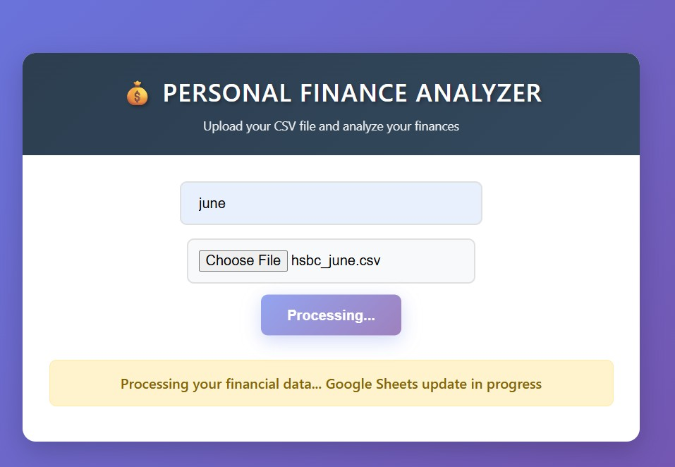

### Terminal Visualization - Financial Overview
- ASCII-based bar charts for income/expense comparison
- Visual savings rate analysis
- User stories covered: 3, 9, 10, 11

    
Financial Overview Screenshot

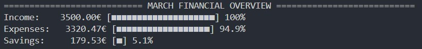

### Terminal Visualization - Intelligent Categorization 
- Automatic categorization of transactions based on description patterns
- Comprehensive category system covering common expense types
- Customizable category definitions
- User stories covered: 2
  

    
Intelligent Categorization Screenshot

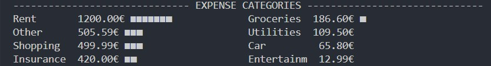

### Terminal Visualization - Financial Daily Spending Analysis
- Income vs expense calculation
- Savings rate analysis
- Daily average spending per category
- Norm violation detection (10% over daily limits)
- User stories covered: 4, 10, 11

    
Daily Spending Analysis

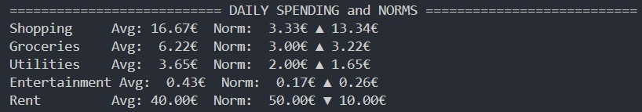

### Terminal Personalized Recommendations
- Actionable financial advice
- Specific spending recommendations
- User stories covered: 5, 8, 10, 11, 13

    
Personalized Recommendations

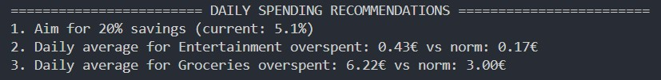

### Google Sheets Integration
- Automated export to structured spreadsheet
- Monthly tracking in organized format
- Professional formatting with borders and colors
- Category percentage calculations
- User stories covered: 6, 7, 8, 11, 12, 13

    
Financial Data Analisys and Google Sheet Update in Progress

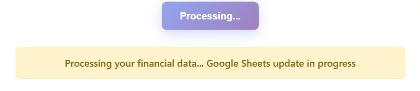

### Google Sheets Financial Transactions Table
- A clean, sortable table component that displays a user's monthly income and expenses.
- Data Display: Shows transactions in a table with columns for Date, Description, Amount, Type (Income/Expense), and Category.
- Default Sorting: Transactions are sorted by date in descending order (newest first).
- Styling: Uses color-coding (e.g., red for expenses, green for income) to enhance readability.
- Data Structure: Accepts an array of transaction objects with id, date, description, amount, type, and category properties.
- Currency: Formats amounts in Euros (€) with proper thousand separators and decimals.
- User stories covered: 6, 7, 8, 11, 12, 13

    
Google Sheets Financial Transactions Table

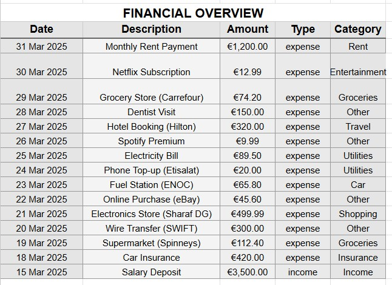

### Google Sheets Financial Summary & Categorization

- A dashboard widget that provides a high-level financial summary and a detailed breakdown of income and expenses by category.
- Financial Summary: Displays three key metrics: Total Income, Total Expenses, and Savings (Income - Expenses), both as amounts and as a percentage of income.
- Categorization: Breaks down all transactions into predefined income and expense categories.
- Visual Data: Shows the amount spent/earned in each category and its percentage contribution to the total income or total expenses.
- Empty States: Handles categories with no transactions (e.g., Dining, Transport) by showing €0.00 and 0.00%.
- Purpose: To give users a quick, clear overview of their financial health and spending patterns at a glance.
- User stories covered: 6, 7, 8, 11, 12, 13

    
Google Sheets Financial Summary & Categorization

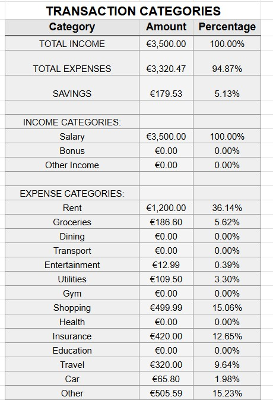

### Google Sheets Financial Health Summary Bar
- A compact, at-a-glance component that displays the user's key financial metrics for a given period.
- Core Metrics: Clearly shows three vital numbers: Total Income, Total Expenses, and Savings (calculated as Income - Expenses).
- Percentage Context: Each value is accompanied by a percentage, showing expenses and savings as a proportion of total income, providing immediate context.
- Compact Design: Presents all critical financial health information in a single, easy-to-read bar format, ideal for dashboards and summaries.
- Automatic Calculation: The "Savings" value and all percentages are automatically calculated from the provided income and expense data.
- Purpose: To give users an instant snapshot of their financial outcome (deficit, surplus, or break-even) for the selected period.
- User stories covered: 6, 7, 8, 11, 12, 13

    
Google Sheets Financial Health Summary Bar

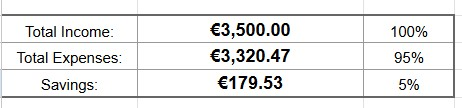

### Google Sheets Personalized Financial Recommendations
- A smart component that analyzes a user's spending habits and provides actionable, prioritized recommendations to improve their financial health.
- Priority-Based List: Displays recommendations in a numbered list, ordered by importance and potential impact.
- Data-Driven Insights: Generates advice by comparing the user's actual spending (e.g., daily averages) against predefined financial norms or goals.
- Clear Metrics: Provides specific, quantifiable data to show the user where they stand versus their target (e.g., "current: 5.1%", "overspent: 6.22€ vs norm: 3.00€").
- Goal-Oriented: Focuses on key financial objectives like achieving a target savings rate (e.g., 20%) and controlling daily spending in specific categories.
- Purpose: To act as a personalized financial coach, helping users understand their spending patterns and offering clear steps to optimize their budget.
- User stories covered: 5, 6, 7, 8, 11, 12, 13

    
Google Sheets Personalized Financial Recommendations

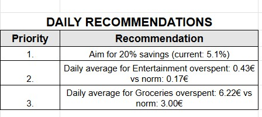

### Google Sheets Multi-Month Financial Summary
- A comparative financial dashboard that displays income, expenses, and savings across multiple months in a single view.
- Multi-Period View: Shows financial data side-by-side for different months (e.g., January, February, March) for easy comparison.
- Structured Layout: Uses a table format with columns for each month, containing both monetary sums and percentage breakdowns.
- Key Metrics: Total Income, Total Expenses, and Savings for each period.
- Detailed Categorization: A full list of income sources and expense categories with their respective amounts and percentages of the total.
- Percentage Context: Every sum is accompanied by its percentage relative to the total income (for income and savings) or total expenses (for expense categories), providing immediate insight into spending distribution.
- Purpose: To allow users to track their financial progress and spending trends over time, identifying patterns and changes in their financial behavior.
- User stories covered: 6, 7, 8, 11, 12, 13

    
Google Sheets Multi-Month Financial Summary

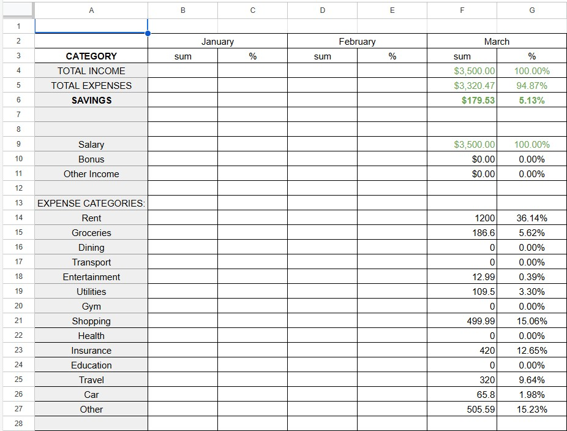

### Validation & Error Handling
The code includes basic error handling for:
- Missing transaction files (`FileNotFoundError`)
- Invalid data formats in CSV rows (`ValueError`)
- General exceptions during Google Sheets operations (`Exception`)

- User stories covered: 1, 9, 12

    
Successful Validation & Updating

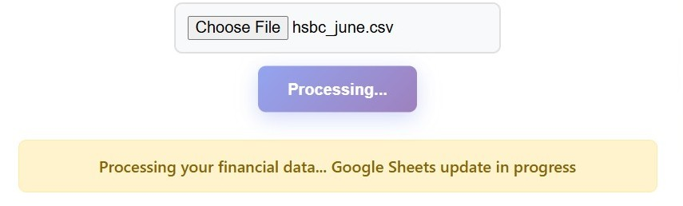

    
Validation & Error Handling

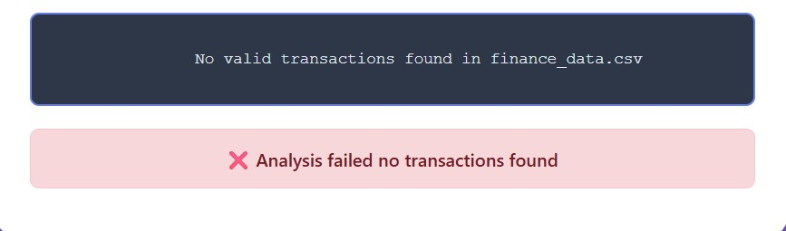

#### Testing 
## Manual testing:
The testing approach is as follows:
1. Manual testing of core functionality
2. Data validation and error handling testing
3. Google Sheets integration testing

See functionality testing
File Loading and Transaction Processing

1. I want to analyze my monthly spending from HSBC bank exports

| **Feature**   | **Action**                    | **Expected Result**          | **Actual Result** |
| ------------- | ----------------------------- | ---------------------------- | ----------------- |
| CSV file loading	 | Provide valid HSBC CSV file | Transactions loaded and categorized correctly | Works as expected |
| File not found | Provide non-existent filename | Error message displayed, program exits gracefully | Works as expected |
| Invalid data rows	 | Process CSV with malformed rows | Invalid rows skipped, valid rows processed | Works as expected |

Screenshot

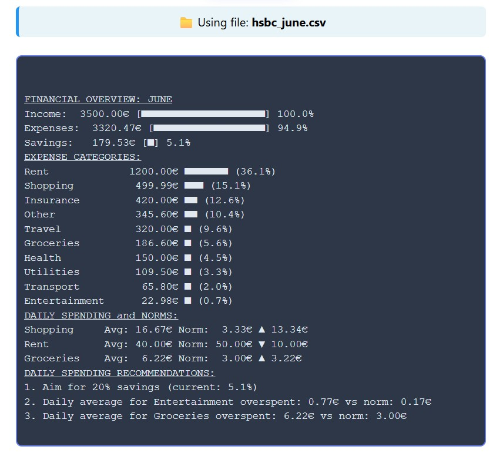

Screenshot

Screenshot

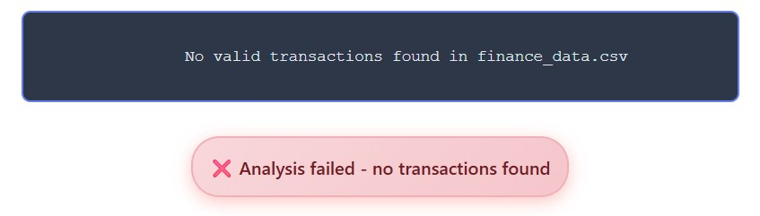

Screenshot

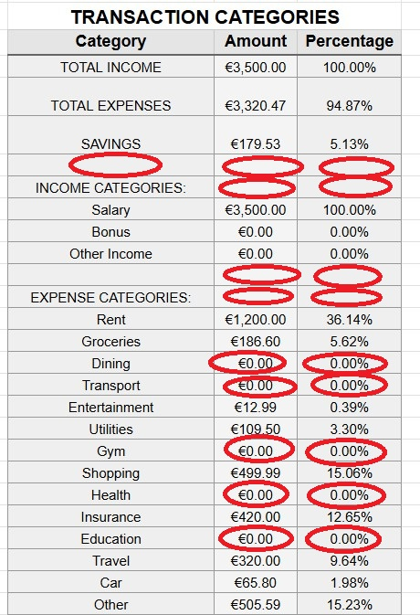

2. I want my transactions to be automatically categorized intelligently

| **Feature**   | **Action**                    | **Expected Result**          | **Actual Result** |
| ------------- | ----------------------------- | ---------------------------- | ----------------- |
| Income detection | Process transactions with 'Credit' type | Correctly categorized as income | Works as expected |
| Expense and income categorization | Process various transaction descriptions | Correct category assignment based on keywords | Works as expected |
| Unknown categories | Process transactions without matching keywords | Categorized as 'Other' | Works as expected |

Screenshot

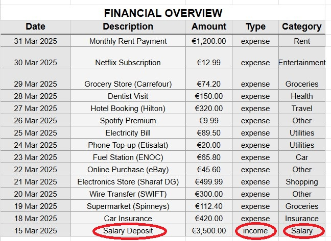

Screenshot

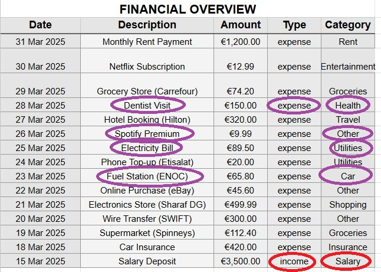

3. I want to see clear financial summaries with calculations

| **Feature**   | **Action**                    | **Expected Result**          | **Actual Result** |
| ------------- | ----------------------------- | ---------------------------- | ----------------- |
| Income calculation | Process income transactions | Total income correctly summed | Works as expected |
| Expense calculation | Process multiple expense transactions | Total expenses correctly summed | Works as expected |
| Savings calculation | Calculate savings from income and expenses | Savings = Income - Expenses | Works as expected |
| Daily averages | Calculate daily average expenses | Correct daily average calculation | Works as expected |

Month Financial Overview

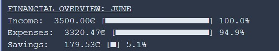

Screenshot

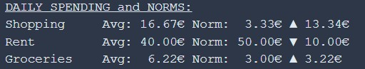

Screenshot

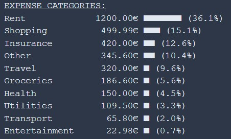

4. I want to visualize my finances with clear charts and graphs

| **Feature**   | **Action**                    | **Expected Result**          | **Actual Result** |
| ------------- | ----------------------------- | ---------------------------- | ----------------- |
| Summary display | Process and display transactions | Income, expenses, savings shown with visual bars | Works as expected |
| Category breakdown | Display multiple expense categories | Top categories displayed with visual bars | Works as expected |
| Daily norms comparison | Compare spending vs daily norms | Visual comparison with arrows and differences | Works as expected |

Screenshot

Screenshot

Screenshot

5. I want to receive personalized financial recommendations

| **Feature**   | **Action**                    | **Expected Result**          | **Actual Result** |
| ------------- | ----------------------------- | ---------------------------- | ----------------- |
| Savings recommendations | Detect low savings rate | Suggestion to aim for 20% savings | Works as expected |
| Overspending alerts | Identify categories over daily norms | Specific recommendations for 10% over norm overspent categories	 | Works as expected |
| Fallback recommendations | Handle cases with no specific issues | General money-saving tips	 | Works as expected |

Screenshots

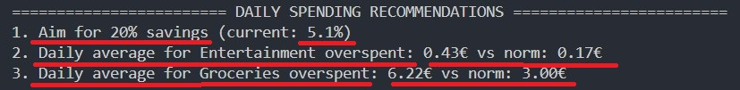

Screenshots

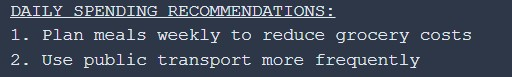

6. I want to export my data to Google Sheets automatically

| **Feature**   | **Action**                    | **Expected Result**          | **Actual Result** |
| ------------- | ----------------------------- | ---------------------------- | ----------------- |
| Month Worksheet update | Process data for new month	 | New worksheet created automatically | Works as expected |
| Data formatting | Export transactions to Google Sheets	 | Proper currency and percentage formatting | Works as expected |
| Summary update | Update monthly data in SUMMARY sheet	 | Data written to SUMMARY sheet with proper columns | Works as expected |
| Error handling | Simulate API connectivity issues	 | Graceful error messages, continued local operation | Works as expected |

Month sheet created/updated and formated

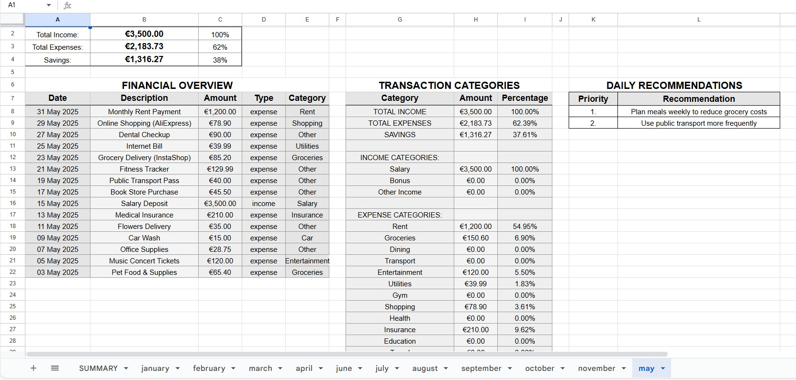

Summary worksheet updated and formated

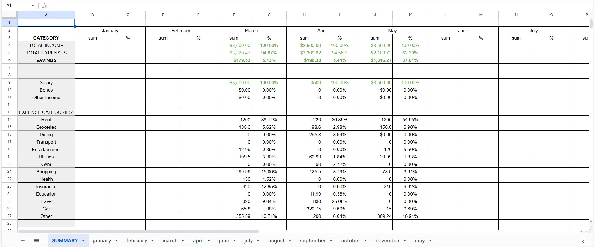

/No valid data found error

7. I want the program to handle errors gracefully

| **Feature**   | **Action**                    | **Expected Result**          | **Actual Result** |
| ------------- | ----------------------------- | ---------------------------- | ----------------- |
| Invalid user input | Enter non-existent month  | No valid data found error handled gracefully | Works as expected |
| Division by zero | Process data with no income  | Handled with default values (0) | Works as expected |
| API rate limiting | Make multiple rapid API requests  | Sleep intervals prevent rate limiting | Works as expected |

No valid data found error handled

8. I want my exported data to be professionally formatted

| **Feature**   | **Action**                    | **Expected Result**          | **Actual Result** |
| ------------- | ----------------------------- | ---------------------------- | ----------------- |
| Transaction export | Update Google Sheets with transactions  | All transactions exported with categories | Works as expected |
| Financial summary | Update SUMMARY sheet with totals  | Totals and percentages calculated correctly | Works as expected |
| Format preservation | Apply cell formatting in Google Sheets  | Currency, percentages, colors maintained | Works as expected |

Income Detection Expense Categories

Summary Worksheet Update

9. I want a user-friendly experience with clear feedback

| **Feature**   | **Action**                    | **Expected Result**          | **Actual Result** |
| ------------- | ----------------------------- | ---------------------------- | ----------------- |
| Progress feedback | Monitor long operations  | Status messages during processing | Works as expected |
| Visual appeal | View terminal output  | Clean formatting with left-justified headers | Works as expected |
| Recommendation clarity | Generate financial advice  | Specific, measurable suggestions | Works as expected |

/Processing Financial Data, Google Sheet Update in Progress

Screenshots

Screenshots

Screenshots

Screenshots

Screenshots

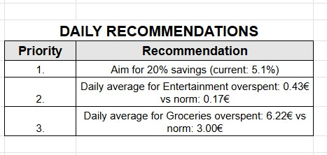

Screenshots

10. I want to track my finances across multiple months

| **Feature**   | **Action**                    | **Expected Result**          | **Actual Result** |
| ------------- | ----------------------------- | ---------------------------- | ----------------- |
| Month handling | Process different month names  | Proper normalization and processing | Works as expected |
| Column management | Organize SUMMARY sheet data  | New columns created for new months | Works as expected |
| Data separation | Handle monthly data  | Isolation between different months' data | Works as expected |

Summary Worksheet Update

Using File Name Message

Test Data Used:
- Sample HSBC CSV files for multiple months
- Various transaction types and amounts
- Edge cases (no income, high expenses, zero transactions)
- Different category combinations

Testing Environment:
- Python 3.8+
- Google Sheets API with valid credentials
- HSBC CSV format samples
- Both valid and invalid input scenarios

Results:
All core functionality tested successfully with expected results.

The application handles:

- File I/O operations robustly

- Data validation and error handling

- Google Sheets integration

- Financial calculations accurately

- User-friendly terminal output

- Edge cases and error conditions

The application meets all functional requirements and provides valuable financial insights through both terminal output and Google Sheets integration.

####  Deployment
## Local Deployment
- Clone the repository
- Install required dependencies: pip install gspread gspread-formatting
- Set up Google Sheets API credentials (creds.json)
- Place HSBC CSV files in the working directory
- Run the application: python run.py

#### Google Sheets Setup
- Create a Google Sheet with ID
- Add a worksheet named "SUMMARY"
- Share the sheet with the service account email from your credentials `creds.json` file, giving it editor permissions.
- User stories covered: 9

## Validation

[PEP8 Validation Service](http://pep8online.com/) was used to check the code for PEP8 requirements. All the code passes with no errors and no warnings to show.

PEP3 check for run.py

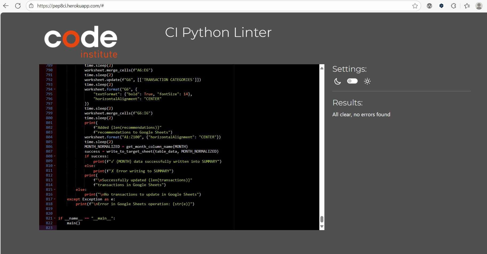

## Testing
### Manual Testing

See user stories testing

[Back to Table Of Contents](#table-of-contents)
## Bugs

| **Bug** | **Fix** |
| ------- | ------- |
|   Google Sheets timeout errors during large data uploads   | Implemented batch processing with 5-second delays between API calls and reduced batch size to 5 rows |
| Status message not displaying during file processing | Added JavaScript event listeners to show/hide status elements and fixed CSS display properties |
| CSV parsing errors with special characters and encoding | Added proper UTF-8 encoding handling and error-resistant line parsing with try-catch blocks |
| Heroku deployment issues with temporary file storage | Implemented proper tempfile cleanup using shutil and automatic directory removal after processing |
| Google API authentication failures in production | Created dual credential handling system for local development vs Heroku environment variables |
| Month column detection failures in SUMMARY sheet | Enhanced header parsing logic with normalization and fallback empty column detection |
| Percentage formatting errors in Google Sheets | Added explicit number formatting with PERCENT pattern and center alignment for percentage columns |
| File upload validation issues | Implemented secure filename handling and proper file extension validation using Werkzeug |
| Concurrent access issues with Google Sheets | Added threading for asynchronous operations to prevent blocking the main application thread |
| Memory leaks with large CSV files | Optimized data processing with simplified datasets for large files and proper resource cleanup |

## Deployment

### Heroku
This application has been deployed from GitHub to Heroku by following the steps:

1. Heroku App Creation
- Created a new Heroku application using the Heroku CLI or web dashboard
- Set the application name to match the project requirements

2. Environment Configuration
Configured the following environment variables in Heroku:
- GOOGLE_SERVICE_ACCOUNT_JSON: Added the complete Google Service Account JSON credentials for Google Sheets API access
- PORT: Set to allow Heroku to assign the appropriate port dynamically

3. Buildpack Setup
- Added the Python buildpack to handle Python application deployment
- Verified buildpack compatibility with the application requirements

4. Procfile Configuration
Created a Procfile with the following content:

text
web: python run.py
This specifies the command to start the web application process

5. Requirements File
Maintained an updated requirements.txt file with all necessary dependencies:
- Flask
- gspread
- google-auth
- gspread-formatting
- Werkzeug

6. GitHub Integration
- Connected the GitHub repository to Heroku for automatic deployments
- Enabled automatic deploys from the main branch
- Set up deployment hooks for continuous integration

7. Deployment Process
- Pushed code to the main GitHub branch triggered automatic deployment to Heroku
- Monitored build logs through Heroku's dashboard for any deployment issues
- Verified successful deployment by checking application status

8. Post-Deployment Verification
8.1 Tested the live application functionality:
- File upload capability
- Google Sheets integration
- Financial analysis processing
- Response time and performance

8.2 Verified that environment variables were properly loaded
8.3 Confirmed that all third-party API connections were functioning correctly

9. Monitoring and Maintenance
- Set up Heroku logs for ongoing monitoring
- Configured error tracking and performance monitoring
- Established a process for regular updates and maintenance

### Forking the GitHub Repository
1. Go to the GitHub repository
2. Click on Fork button in top right corner
3. You will then have a copy of the repository in your own GitHub account.
   
### Making a Local Clone
1. Go to the GitHub repository 
2. Locate the Code button above the list of files and click it
3. Highlight the "HTTPS" button to clone with HTTPS and copy the link
4. Open Git Bash
5. Change the current working directory to the one where you want the cloned directory
6. Type git clone and paste the URL from the clipboard ($ git clone https://github.com/YOUR-USERNAME/YOUR-REPOSITORY)
7. Press Enter to create your local clone

[Back to Table Of Contents](#table-of-contents)

## Credits

- Code Institute - for git template IDE and "Love Sandwiches - Essentials Project" which helped me with connecting the Google Spreadsheet to my project

- [gspread documentation](https://docs.gspread.org/en/latest/user-guide.html) - explained how to work with the Google Spreadsheet API for reading and writing data

- [Flask documentation](https://flask.palletsprojects.com/) - helped me understand how to create web applications, handle file uploads, and serve dynamic templates

- [Google Auth documentation](https://google-auth.readthedocs.io/) - provided guidance on setting up service account authentication for Google APIs

- [Stack Overflow](https://stackoverflow.com/) - various threads helped me solve specific implementation challenges throughout the development process

- [Python CSV documentation](https://docs.python.org/3/library/csv.html) - guided me on proper CSV file parsing techniques for financial transaction data

- [Werkzeug documentation](https://werkzeug.palletsprojects.com/) - helped me implement secure filename handling for uploaded files

- [gspread-formatting documentation](https://gspread-formatting.readthedocs.io/) - provided examples for advanced spreadsheet formatting and styling

- [Python datetime documentation](https://docs.python.org/3/library/datetime.html) - assisted with date parsing and formatting for transaction processing

- [Heroku documentation](https://devcenter.heroku.com/) - guided me through the deployment process and environment configuration

## Acknowledgements
I would like to thank everyone who supported me in the development of this project:
- My mentor Mo for professional guidance, helpful feedback and words of encouragement whilst creating the project. Also, for encouraging me to learn about the unit test and including it within this project.
- My family for their support and testing the app with me
- Code Institute community on Slack for resources and support
