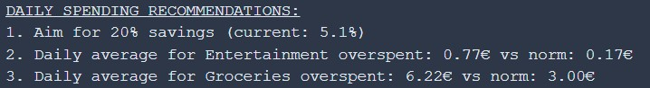
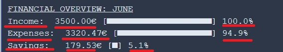
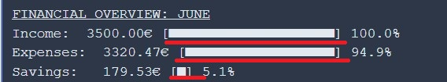

# Finance Manager 

**Developer: Nataliia Illiashenko**

💻 [Visit live website](https://ci-pp3-connect4.onrender.com/)


## About

Personal Finance Analyzer is a comprehensive financial management application that helps users track, analyze, and visualize their spending patterns. The application processes bank transaction data (specifically HSBC CSV exports), categorizes expenses, compares spending against daily norms, and provides personalized financial recommendations.

The application features both terminal-based visualization and Google Sheets integration for detailed financial reporting and historical tracking.

## Table of Contents
  - [Project Goals](#project-goals)
    - [User Goals](#user-goals)
    - [Site Owner Goals](#site-owner-goals)
  - [User Experience](#user-experience)
    - [Target Audience](#target-audience)
    - [User Requirements and Expectations](#user-requirements-and-expectations)
    - [User Manual](#user-manual)
  - [User Stories](#user-stories)
    - [Users](#users)
    - [Site Owner](#site-owner)
  - [Technical Design](#technical-design)
    - [Flowchart](#flowchart)
  - [Technologies Used](#technologies-used)
    - [Languages](#languages)
    - [Frameworks & Tools](#frameworks--tools)
    - [Libraries](#libraries)
  - [Features](#features)
  - [Validation](#validation)
  - [Testing](#testing)
    - [Manual Testing](#manual-testing)
    - [Automated Testing](#automated-testing)
  - [Bugs](#bugs)
  - [Deployment](#deployment)
  - [Credits](#credits)
  - [Acknowledgements](#acknowledgements)

## Project Goals

### User Goals

- Automatically categorize bank transactions into meaningful categories
- Visualize spending patterns through terminal-based charts and graphs
- Compare actual spending against personalized daily norms
- Receive actionable financial recommendations
- Maintain historical financial data in Google Sheets for long-term tracking
- Export financial reports to organized spreadsheets

### Site Owner Goals

- Create an intuitive financial analysis tool that requires minimal user input
- Provide clear visual feedback on spending habits
- Help users identify areas for potential savings
- Ensure data privacy and security through local processing
- Offer seamless integration with Google Sheets for data persistence

## User Experience

### Target Audience

This application is designed for individuals who want to:
- Gain better insight into their spending habits
- Track expenses against budgeting goals
- Automate financial categorization and reporting
- Maintain organized financial records without manual data entry

### User Requirements and Expectations

- Simple CSV file-based input system
- Clear terminal visualization of financial data
- Accurate transaction categorization
- Meaningful comparison against spending norms
- Practical financial recommendations
- Reliable Google Sheets integration


## User Stories

### Users

1. As a user, I want to automatically categorize my bank transactions
2. As a user, I want to see my income vs expenses visualized clearly
3. As a user, I want to compare my spending against reasonable daily norms
4. As a user, I want to receive personalized recommendations to improve my finances
5. As a user, I want my financial data to be saved to Google Sheets for future reference
6. As a user, I want to analyze spending by category with visual indicators
7. As a user, I want to easily identify areas where I'm overspending

### Site Owner

8. As the owner, I want to provide clear visual feedback through terminal graphics
9. As the owner, I want to help users develop better financial habits
10. As the owner, I want the Google Sheets integration to be reliable and consistent
10. As the owner, I want the categorization system to be comprehensive and accurate

[Back to Table Of Contents](#table-of-contents)

## Technical Design

### Flowchart

The application follows this general workflow:
1. User inputs month name
1. User uploads corresponding HSBC CSV file
2. Application loads the HSBC CSV file and
starts the analysis of the data from it for
the month name from the input
3. Transactions are categorized and analyzed
4. Terminal visualization is displayed
5. Data is exported to Google Sheets
6. Recommendations are generated based on spending patterns

<details><summary>Flowchart</summary>

</details>

## Technologies Used

### Languages

- [Python](https://www.python.org/) programming language for the logic of the program

### Frameworks & Tools

- [Diagrams.net](https://app.diagrams.net/) was used to draw program flowchart
- [Git](https://git-scm.com/) was used for version control within VSCode to push the code to GitHub
- [GitHub](https://github.com/) was used as a remote repository to store project code
- [Google Cloud Platform](https://cloud.google.com/cloud-console/) was used to manage access and permissions to the Google Services such as Google auth, sheets etc.
- [Google Sheets](https://www.google.co.uk/sheets/about/) were used to store user's financial data
- [PEP8](http://pep8online.com/) was used to check my code against Python conventions
- [Heroku Platform](https://dashboard.heroku.com/) was used to deploy the project into live environment
- [Visual Studio Code (VSCode)](https://code.visualstudio.com/)
VSCode was used to write the project code using Code Institute template

### Libraries

#### Python Libraries
- os - used to clear terminal
- gspread - Google Sheets API wrapper
- csv - CSV file processing
- collections - Specialized container datatypes
- tertools - Functions creating iterators for efficient looping
- gspread_formatting - Google Sheets formatting
- time - used to displayed delayed messages in the terminal
- [unittest](https://docs.python.org/3/library/unittest.html) - used to carry out testing on single units in validation.py file

#### Third Party Libraries
- [colorama](https://pypi.org/project/colorama/) - JUSTIFICATION: I used this library to add color to the terminal and enhance user experience. I marked warning/error information with color red and user feedback with blue and green
- [email_validator](https://pypi.org/project/email-validator/) - JUSTIFICATION: I used this library to validate if user email input is of the form name@</span>example.com
- [gspread](https://docs.gspread.org/en/latest/) - JUSTIFICATION: I used gspread to add and manipulate data in my Google spreadsheet and to interact with Google APIs
- [google.oauth2.service_account](https://google-auth.readthedocs.io/en/master/) - JUSTIFICATION: module used to set up the authentification needed to access the Google API and connect my Service Account with the Credentials function. A creds.json file is created with all details the API needs to access the google account. In deployment to Render this information is stored in the config var section.

[Back to Table Of Contents](#table-of-contents)

## Features
### CSV Transaction Loading
- Loads and parses HSBC bank statement CSV files
- Handles various transaction types (debits/credits)
- Robust error handling for malformed data

<details>
    <summary>CSV Transaction Loading Screenshot</summary>


</details>


### Terminal Visualization - Financial Overview
- ASCII-based bar charts for income/expense comparison
- Visual savings rate analysis
- User stories covered: 4

<details>
    <summary>Financial Overview Screenshot</summary>


</details>

### Terminal Visualization - Intelligent Categorization 
- Automatic categorization of transactions based on description patterns
- Comprehensive category system covering common expense types
- Customizable category definitions
- User stories covered: 2
  
<details>
    <summary>Intelligent Categorization Screenshot</summary>


</details>

### Terminal Visualization - Financial Daily Spending Analysis
- Income vs expense calculation
- Savings rate analysis
- Daily average spending per category
- Norm violation detection (10% over daily limits)
- User stories covered: 4, 5, 12, 13, 14

<details>
    <summary>Daily Spending Analysis</summary>


</details>

### Terminal Personalized Recommendations
- Actionable financial advice
- Specific spending recommendations
- User stories covered: 4, 5, 12, 13, 14

<details>
    <summary>Personalized Recommendations</summary>


</details>

### Google Sheets Integration
- Automated export to structured spreadsheet
- Monthly tracking in organized format
- Professional formatting with borders and colors
- Category percentage calculations
- User stories covered: 5, 12, 13, 14

<details>
    <summary>Worksheet Found, Updating</summary>


</details>

<details>
    <summary>Rows Data Preparation and Formating</summary>


</details>

<details>
<summary>Data written to SUMMARY worksheet</summary>


</details>

### Google Sheets Financial Transactions Table
- A clean, sortable table component that displays a user's monthly income and expenses.
- Data Display: Shows transactions in a table with columns for Date, Description, Amount, Type (Income/Expense), and Category.
- Default Sorting: Transactions are sorted by date in descending order (newest first).
- Styling: Uses color-coding (e.g., red for expenses, green for income) to enhance readability.
- Data Structure: Accepts an array of transaction objects with id, date, description, amount, type, and category properties.
- Currency: Formats amounts in Euros (€) with proper thousand separators and decimals.
- User stories covered: 5, 12, 13, 14

<details>
    <summary>Google Sheets Financial Transactions Table</summary>


</details>

### Google Sheets Financial Summary & Categorization

- A dashboard widget that provides a high-level financial summary and a detailed breakdown of income and expenses by category.
- Financial Summary: Displays three key metrics: Total Income, Total Expenses, and Savings (Income - Expenses), both as amounts and as a percentage of income.
- Categorization: Breaks down all transactions into predefined income and expense categories.
- Visual Data: Shows the amount spent/earned in each category and its percentage contribution to the total income or total expenses.
- Empty States: Handles categories with no transactions (e.g., Dining, Transport) by showing €0.00 and 0.00%.
- Purpose: To give users a quick, clear overview of their financial health and spending patterns at a glance.
- User stories covered: 5, 12, 13, 14

<details>
    <summary>Google Sheets Financial Summary & Categorization</summary>


</details>

### Google Sheets Financial Health Summary Bar
- A compact, at-a-glance component that displays the user's key financial metrics for a given period.
- Core Metrics: Clearly shows three vital numbers: Total Income, Total Expenses, and Savings (calculated as Income - Expenses).
- Percentage Context: Each value is accompanied by a percentage, showing expenses and savings as a proportion of total income, providing immediate context.
- Compact Design: Presents all critical financial health information in a single, easy-to-read bar format, ideal for dashboards and summaries.
- Automatic Calculation: The "Savings" value and all percentages are automatically calculated from the provided income and expense data.
- Purpose: To give users an instant snapshot of their financial outcome (deficit, surplus, or break-even) for the selected period.
- User stories covered: 5, 12, 13, 14

<details>
    <summary>Google Sheets Financial Health Summary Bar</summary>


</details>

### Google Sheets Personalized Financial Recommendations
- A smart component that analyzes a user's spending habits and provides actionable, prioritized recommendations to improve their financial health.
- Priority-Based List: Displays recommendations in a numbered list, ordered by importance and potential impact.
- Data-Driven Insights: Generates advice by comparing the user's actual spending (e.g., daily averages) against predefined financial norms or goals.
- Clear Metrics: Provides specific, quantifiable data to show the user where they stand versus their target (e.g., "current: 5.1%", "overspent: 6.22€ vs norm: 3.00€").
- Goal-Oriented: Focuses on key financial objectives like achieving a target savings rate (e.g., 20%) and controlling daily spending in specific categories.
- Purpose: To act as a personalized financial coach, helping users understand their spending patterns and offering clear steps to optimize their budget.
- User stories covered: 5, 12, 13, 14

<details>
    <summary>Google Sheets Personalized Financial Recommendations</summary>


</details>

### Google Sheets Multi-Month Financial Summary
- A comparative financial dashboard that displays income, expenses, and savings across multiple months in a single view.
- Multi-Period View: Shows financial data side-by-side for different months (e.g., January, February, March) for easy comparison.
- Structured Layout: Uses a table format with columns for each month, containing both monetary sums and percentage breakdowns.
- Key Metrics: Total Income, Total Expenses, and Savings for each period.
- Detailed Categorization: A full list of income sources and expense categories with their respective amounts and percentages of the total.
- Percentage Context: Every sum is accompanied by its percentage relative to the total income (for income and savings) or total expenses (for expense categories), providing immediate insight into spending distribution.
- Purpose: To allow users to track their financial progress and spending trends over time, identifying patterns and changes in their financial behavior.
- User stories covered: 5, 12, 13, 14

<details>
    <summary>Google Sheets Multi-Month Financial Summary</summary>


</details>

### Validation & Error Handling
The code includes basic error handling for:
- Missing transaction files (`FileNotFoundError`)
- Invalid data formats in CSV rows (`ValueError`)
- General exceptions during Google Sheets operations (`Exception`)

- User stories covered: 3, 5, 6, 13, 14

<details>
    <summary>Validation & Error Handling</summary>


</details>


#### Testing 
## Manual testing:
The testing approach is as follows:
1. Manual testing of core functionality
2. Data validation and error handling testing
3. Google Sheets integration testing

<details><summary>See functionality testing</summary>
File Loading and Transaction Processing

1. I want to analyze my monthly spending from HSBC bank exports

| **Feature**   | **Action**                    | **Expected Result**          | **Actual Result** |
| ------------- | ----------------------------- | ---------------------------- | ----------------- |
| CSV file loading	 | Provide valid HSBC CSV file | Transactions loaded and categorized correctly | Works as expected |
| File not found | Provide non-existent filename | Error message displayed, program exits gracefully | Works as expected |
| Invalid data rows	 | Process CSV with malformed rows | Invalid rows skipped, valid rows processed | Works as expected |

<details><summary>Screenshot</summary>

</details>
<details><summary>Screenshot</summary>

</details>
<details><summary>Screenshot</summary>

</details>

2. I want my transactions to be automatically categorized intelligently

| **Feature**   | **Action**                    | **Expected Result**          | **Actual Result** |
| ------------- | ----------------------------- | ---------------------------- | ----------------- |
| Income detection | Process transactions with 'Credit' type | Correctly categorized as income | Works as expected |
| Expense and income categorization | Process various transaction descriptions | Correct category assignment based on keywords | Works as expected |
| Unknown categories | Process transactions without matching keywords | Categorized as 'Other' | Works as expected |

<details><summary>Screenshot</summary>

</details>
<details><summary>Screenshot</summary>

</details>

3. I want to see clear financial summaries with calculations

| **Feature**   | **Action**                    | **Expected Result**          | **Actual Result** |
| ------------- | ----------------------------- | ---------------------------- | ----------------- |
| Income calculation | Process multiple income transactions | Total income correctly summed | Works as expected |
| Expense calculation | Process multiple expense transactions | Total expenses correctly summed | Works as expected |
| Savings calculation | Calculate savings from income and expenses | Savings = Income - Expenses | Works as expected |
| Daily averages | Calculate daily avirage expenses | Correct daily average calculation | Works as expected |

<details><summary>Screenshot</summary>

</details>
<details><summary>Screenshot</summary>

</details>
<details><summary>Screenshot</summary>

</details>

4. I want to visualize my finances with clear charts and graphs

| **Feature**   | **Action**                    | **Expected Result**          | **Actual Result** |
| ------------- | ----------------------------- | ---------------------------- | ----------------- |
| Summary display | Process and display transactions | Income, expenses, savings shown with visual bars | Works as expected |
| Category breakdown | Display multiple expense categories | Top categories displayed with visual bars | Works as expected |
| Daily norms comparison | Compare spending vs daily norms | Visual comparison with arrows and differences | Works as expected |

<details><summary>Screenshot</summary>

</details>
<details><summary>Screenshot</summary>

</details>
<details><summary>Screenshot</summary>

</details>

5. I want to receive personalized financial recommendations

| **Feature**   | **Action**                    | **Expected Result**          | **Actual Result** |
| ------------- | ----------------------------- | ---------------------------- | ----------------- |
| Savings recommendations | Detect low savings rate | Suggestion to aim for 20% savings | Works as expected |
| Overspending alerts | Identify categories over daily norms | Specific recommendations for 10% over norm overspent categories	 | Works as expected |
| Fallback recommendations | Handle cases with no specific issues | General money-saving tips	 | Works as expected |

<details><summary>Screenshots</summary>

</details>
<details><summary>Screenshots</summary>

</details>

6. I want to export my data to Google Sheets automatically

| **Feature**   | **Action**                    | **Expected Result**          | **Actual Result** |
| ------------- | ----------------------------- | ---------------------------- | ----------------- |
| Worksheet creation | Process data for new month	 | New worksheet created automatically | Works as expected |
| Data formatting | Export transactions to Google Sheets	 | Proper currency and percentage formatting | Works as expected |
| Summary update | Update monthly data in SUMMARY sheet	 | Data written to SUMMARY sheet with proper columns | Works as expected |
| Error handling | Simulate API connectivity issues	 | Graceful error messages, continued local operation | Works as expected |

<details><summary>Screenshots</summary>

</details>
<details><summary>Screenshots</summary>

</details>
<details><summary>Screenshots</summary>

</details>
<details><summary>Screenshots</summary>

</details>

7. I want the program to handle errors gracefully

| **Feature**   | **Action**                    | **Expected Result**          | **Actual Result** |
| ------------- | ----------------------------- | ---------------------------- | ----------------- |
| Invalid user input | Enter non-existent month  | File not found error handled gracefully | Works as expected |
| Division by zero | Process data with no income  | Handled with default values (0) | Works as expected |
| API rate limiting | Make multiple rapid API requests  | Sleep intervals prevent rate limiting | Works as expected |

<details><summary>Screenshot</summary>

</details>

8. I want my exported data to be professionally formatted


| **Feature**   | **Action**                    | **Expected Result**          | **Actual Result** |
| ------------- | ----------------------------- | ---------------------------- | ----------------- |
| Transaction export | Update Google Sheets with transactions  | All transactions exported with categories | Works as expected |
| Financial summary | Update SUMMARY sheet with totals  | Totals and percentages calculated correctly | Works as expected |
| Format preservation | Apply cell formatting in Google Sheets  | Currency, percentages, colors maintained | Works as expected |

<details><summary>Screenshots</summary>

</details>
<details><summary>Screenshots</summary>

</details>

9. I want a user-friendly experience with clear feedback

| **Feature**   | **Action**                    | **Expected Result**          | **Actual Result** |
| ------------- | ----------------------------- | ---------------------------- | ----------------- |
| Progress feedback | Monitor long operations  | Status messages during processing | Works as expected |
| Visual appeal | View terminal output  | Clean formatting with centered headers | Works as expected |
| Recommendation clarity | Generate financial advice	  | Specific, measurable suggestions | Works as expected |

<details><summary>Screenshots</summary>

</details>
<details><summary>Screenshots</summary>

</details>
<details><summary>Screenshots</summary>

</details>
<details><summary>Screenshots</summary>

</details>
<details><summary>Screenshots</summary>

</details>
<details><summary>Screenshots</summary>

</details>

10. I want to track my finances across multiple months

| **Feature**   | **Action**                    | **Expected Result**          | **Actual Result** |
| ------------- | ----------------------------- | ---------------------------- | ----------------- |
| Month handling | Process different month names  | Proper normalization and processing | Works as expected |
| Column management | Organize SUMMARY sheet data  | New columns created for new months | Works as expected |
| Data separation | Handle monthly data  | Isolation between different months' data | Works as expected |

<details><summary>Screenshots</summary>

</details>
<details><summary>Screenshots</summary>

</details>
<details><summary>Screenshots</summary>

</details>

Test Data Used:
- Sample HSBC CSV files for multiple months
- Various transaction types and amounts
- Edge cases (no income, high expenses, zero transactions)
- Different category combinations

Testing Environment:
- Python 3.8+
- Google Sheets API with valid credentials
- HSBC CSV format samples
- Both valid and invalid input scenarios

Results:
All core functionality tested successfully with expected results.

The application handles:

- File I/O operations robustly

- Data validation and error handling

- Google Sheets integration

- Financial calculations accurately

- User-friendly terminal output

- Edge cases and error conditions

The application meets all functional requirements and provides valuable financial insights through both terminal output and Google Sheets integration.

####  Deployment
## Local Deployment
- Clone the repository
- Install required dependencies: pip install gspread gspread-formatting
- Set up Google Sheets API credentials (creds.json)
- Place HSBC CSV files in the working directory
- Run the application: python run.py

#### Google Sheets Setup
- Create a Google Sheet with ID
- Add a worksheet named "SUMMARY"
- Share the sheet with the service account email from your credentials `creds.json` file, giving it editor permissions.
- User stories covered: 9

#### Credits
- HSBC for CSV export format
- Google for Sheets API documentation
- Python community for extensive library support


## Validation

[PEP8 Validation Service](http://pep8online.com/) was used to check the code for PEP8 requirements. All the code passes with no errors and no warnings to show.

<details><summary>PEP3 check for run.py</summary>

</details>


## Testing
### Manual Testing
<details><summary>See user stories testing</summary>


[Back to Table Of Contents](#table-of-contents)
## Bugs

| **Bug** | **Fix** |
| ------- | ------- |
| When selecting 'go back to main menu' option after the game has finished, the game title was not displayed | Correct the function's indentation |
| When selecting a correct menu option after a few wrong numeric inputs the relevant game option was not called | Move the while loop at the top within the function |
| Underscores within the game title were not displayed after deployment to Render portal | Changed color settings for yellow & red |
| Gradient background color does not take up the full screen size | Add background-attachment property |
| Players names input values are not displayed in the game – instead of name a “‘Player1’’s / ‘Player2’’s move.” is shown | Reassign a value of player1name & player2name to the indexed-0 value (name) input by the user in ‘create_new_players’ function |
| Users input data was recorded in the same row in four columns instead of 2 separate rows | Created a list of players and while loop inside the 'register_new_players' function for Google Spreadsheet update separately for two players |
| There were quite a few errors and warnings related to exceeded number of characters in line, whitespace within a blank line, trailing white spaces or missing white spaces around operators | Split the comments or print functions into two separate rows maintaining correct indentation. Followed a guidance within pep8 online tool and corrected all warnings and errors |

## Deployment

### Render
This application has been deployed from GitHub to Render by following the steps:

1. Create or log in to your account at render.com
2. Make sure you have connected your GitHub account to Render.com - follow the steps to Get Started and Sign up for Render. Click “New +” and select “Web Service”, on the right of the page, select “+ Connect account” for GitHub, ensure All repositories is selected and click “Install”
4. Web service creation: Click “New +” and then “Web Service”. Search for relevant repo and click “Connect”.
5. Settings: the web service's configuration settings are required to ensure the application is configured correctly. Add a Setting Name, leave Root Directory blank, add Environment 'Python3', Region (The physical location of the server hosting the web service), Branch - main
6. Set the Build Command:
    ```
    pip install -r requirements.txt && npm install
    ```
7. Set the Start Command
    ```
    node index.js
    ```
8. Set up Environment Variables: Scroll down and click “Advanced” and “Add Environment Variable”. Add a key 'PORT' and value of '8000' and 'PYTHON_VERSION' with value of 3.10.7.
9. Click “Add Secret File” and add a Filename 'creds.json' and file content.
10. Click “Create Web Service” and wait for the project to build. First, the build is initiated. Then the build and deployment processes are carried out. Finally, the application is deployed and ready for public viewing.


### Forking the GitHub Repository
1. Go to the GitHub repository
2. Click on Fork button in top right corner
3. You will then have a copy of the repository in your own GitHub account.
   
### Making a Local Clone
1. Go to the GitHub repository 
2. Locate the Code button above the list of files and click it
3. Highlight the "HTTPS" button to clone with HTTPS and copy the link
4. Open Git Bash
5. Change the current working directory to the one where you want the cloned directory
6. Type git clone and paste the URL from the clipboard ($ git clone <span>https://</span>github.com/YOUR-USERNAME/YOUR-REPOSITORY)
7. Press Enter to create your local clone

[Back to Table Of Contents](#table-of-contents)

## Credits

### Images
- [Flaticon](https://www.flaticon.com/free-icon/connect_1707222) was used for the website favicon

### Code
- [ASCII Art Generator](http://patorjk.com/software/taag/) was used to create game title
- Code Institute - for git template IDE and "Love Sandwiches - Essentials Project" which helped me with connecting the Google Spreadsheet to my project.
- [ColorSpace](https://mycolor.space/gradient) was used to create a gradient button and background effect
- How to install a Python module, eg. [email validation](https://pypi.org/project/email-validator/Installing)
- [gspread documentation](https://docs.gspread.org/en/latest/user-guide.html) explained how to obtain a specific value from the google spreadsheet
- Instructions how to print colored text from [this](https://ozzmaker.com/add-colour-to-text-in-python/) and [this](https://stackabuse.com/how-to-print-colored-text-in-python/) sources
- [Stack overflow](https://stackoverflow.com/questions/20302331/typing-effect-in-python) helped me create typing effect in games rules
- [Stack overflow](https://stackoverflow.com/questions/517970/how-to-clear-the-interpreter-console) code used to clear the terminal console
- Youtube video on [Unit Test in Python](https://www.youtube.com/watch?v=1Lfv5tUGsn8) made by Socratica was very helpful to understand the concept of unit tesing
- Youtube tutorial [“Python Connect 4 Tutorial”](https://www.youtube.com/watch?v=gvP0gNSO17k&t=429s) made by [Spencer Lepine](https://www.youtube.com/channel/UCBL6vAHJZqUlyJp-rcFU55Q) - I used a part of Spencer's code for display of the game board, moves of alternative players and saving last move's coordinates on the board
- Youtube tutorial [“Creating a Connect 4 Game in Python”](https://www.youtube.com/watch?v=Bk2ny_aeG-Y) made by [“Painless Programming”](https://www.youtube.com/channel/UC8ck1Yks7yP33XInXw5GZIw) -  inspired me to create a schemat for winning move logic
<details><summary>See winning move schemat</summary>

</details>

## Acknowledgements
I would like to thank everyone who supported me in the development of this project:
- My mentor Mo for professional guidance, helpful feedback and words of encouragement whilst creating the project. Also, for encouraging me to learn about the unit test and including it within this project.
- My family for their support and testing the app with me
- Code Institute community on Slack for resources and support
