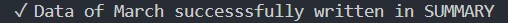

# CONNECT 4 GAME 

**Developer: Nataliia Illiashenko**

💻 [Visit live website](https://ci-pp3-connect4.onrender.com/)


## About

Personal Finance Analyzer is a comprehensive financial management application that helps users track, analyze, and visualize their spending patterns. The application processes bank transaction data (specifically HSBC CSV exports), categorizes expenses, compares spending against daily norms, and provides personalized financial recommendations.

The application features both terminal-based visualization and Google Sheets integration for detailed financial reporting and historical tracking.

## Table of Contents
  - [Project Goals](#project-goals)
    - [User Goals](#user-goals)
    - [Site Owner Goals](#site-owner-goals)
  - [User Experience](#user-experience)
    - [Target Audience](#target-audience)
    - [User Requirements and Expectations](#user-requirements-and-expectations)
    - [User Manual](#user-manual)
  - [User Stories](#user-stories)
    - [Users](#users)
    - [Site Owner](#site-owner)
  - [Technical Design](#technical-design)
    - [Flowchart](#flowchart)
  - [Technologies Used](#technologies-used)
    - [Languages](#languages)
    - [Frameworks & Tools](#frameworks--tools)
    - [Libraries](#libraries)
  - [Features](#features)
  - [Validation](#validation)
  - [Testing](#testing)
    - [Manual Testing](#manual-testing)
    - [Automated Testing](#automated-testing)
  - [Bugs](#bugs)
  - [Deployment](#deployment)
  - [Credits](#credits)
  - [Acknowledgements](#acknowledgements)

## Project Goals

### User Goals

- Automatically categorize bank transactions into meaningful categories
- Visualize spending patterns through terminal-based charts and graphs
- Compare actual spending against personalized daily norms
- Receive actionable financial recommendations
- Maintain historical financial data in Google Sheets for long-term tracking
- Export financial reports to organized spreadsheets

### Site Owner Goals

- Create an intuitive financial analysis tool that requires minimal user input
- Provide clear visual feedback on spending habits
- Help users identify areas for potential savings
- Ensure data privacy and security through local processing
- Offer seamless integration with Google Sheets for data persistence

## User Experience

### Target Audience

This application is designed for individuals who want to:
- Gain better insight into their spending habits
- Track expenses against budgeting goals
- Automate financial categorization and reporting
- Maintain organized financial records without manual data entry

### User Requirements and Expectations

- Simple CSV file-based input system
- Clear terminal visualization of financial data
- Accurate transaction categorization
- Meaningful comparison against spending norms
- Practical financial recommendations
- Reliable Google Sheets integration
- Data privacy (local processing of sensitive financial information)


## User Stories

### Users

1. As a user, I want to automatically categorize my bank transactions
2. As a user, I want to see my income vs expenses visualized clearly
3. As a user, I want to compare my spending against reasonable daily norms
4. As a user, I want to receive personalized recommendations to improve my finances
5. As a user, I want my financial data to be saved to Google Sheets for future reference
6. As a user, I want to analyze spending by category with visual indicators
7. As a user, I want to easily identify areas where I'm overspending

### Site Owner

8. As the owner, I want the application to process data locally for security
9. As the owner, I want to provide clear visual feedback through terminal graphics
10. As the owner, I want to help users develop better financial habits
11. As the owner, I want the Google Sheets integration to be reliable and consistent
12. As the owner, I want the categorization system to be comprehensive and accurate

[Back to Table Of Contents](#table-of-contents)

## Technical Design

### Flowchart

The application follows this general workflow:
1. User inputs month name
2. Application loads corresponding HSBC CSV file
3. Transactions are categorized and analyzed
4. Terminal visualization is displayed
5. Data is exported to Google Sheets (optional)
6. Recommendations are generated based on spending patterns

<details><summary>Flowchart</summary>

</details>

## Technologies Used

### Languages

- [Python](https://www.python.org/) programming language for the logic of the program

### Frameworks & Tools

- [Diagrams.net](https://app.diagrams.net/) was used to draw program flowchart
- [Git](https://git-scm.com/) was used for version control within VSCode to push the code to GitHub
- [GitHub](https://github.com/) was used as a remote repository to store project code
- [Google Cloud Platform](https://cloud.google.com/cloud-console/) was used to manage access and permissions to the Google Services such as Google auth, sheets etc.
- [Google Sheets](https://www.google.co.uk/sheets/about/) were used to store user's financial data
- [PEP8](http://pep8online.com/) was used to check my code against Python conventions
- [Render Platform](https://https://render.com/) was used to deploy the project into live environment
- [Visual Studio Code (VSCode)](https://code.visualstudio.com/)
VSCode was used to write the project code using Code Institute template

### Libraries

#### Python Libraries
- os - used to clear terminal
- gspread - Google Sheets API wrapper
- csv - CSV file processing
- collections - Specialized container datatypes
- tertools - Functions creating iterators for efficient looping
- gspread_formatting - Google Sheets formatting
- time - used to displayed delayed messages in the terminal
- [unittest](https://docs.python.org/3/library/unittest.html) - used to carry out testing on single units in validation.py file

#### Third Party Libraries
- [colorama](https://pypi.org/project/colorama/) - JUSTIFICATION: I used this library to add color to the terminal and enhance user experience. I marked warning/error information with color red and user feedback with blue and green
- [email_validator](https://pypi.org/project/email-validator/) - JUSTIFICATION: I used this library to validate if user email input is of the form name@</span>example.com
- [gspread](https://docs.gspread.org/en/latest/) - JUSTIFICATION: I used gspread to add and manipulate data in my Google spreadsheet and to interact with Google APIs
- [google.oauth2.service_account](https://google-auth.readthedocs.io/en/master/) - JUSTIFICATION: module used to set up the authentification needed to access the Google API and connect my Service Account with the Credentials function. A creds.json file is created with all details the API needs to access the google account. In deployment to Render this information is stored in the config var section.

[Back to Table Of Contents](#table-of-contents)

## Features
### CSV Transaction Loading
- Loads and parses HSBC bank statement CSV files
- Handles various transaction types (debits/credits)
- Robust error handling for malformed data

<details>
    <summary>CSV Transaction Loading Screenshot</summary>


</details>


### Terminal Visualization - Financial Overview
- ASCII-based bar charts for income/expense comparison
- Visual savings rate analysis
- User stories covered: 4

<details>
    <summary>Financial Overview Screenshot</summary>


</details>

### Intelligent Categorization Terminal Visualization
- Automatic categorization of transactions based on description patterns
- Comprehensive category system covering common expense types
- Customizable category definitions
- User stories covered: 2
  
<details>
    <summary>Intelligent Categorization Screenshot</summary>


</details>

### Financial Daily Spending Analysis
- Income vs expense calculation
- Savings rate analysis
- Daily average spending per category
- Norm violation detection (10% over daily limits)
- User stories covered: 4, 5, 12, 13, 14

<details>
    <summary>Daily Spending Analysis</summary>


</details>

### Google Sheets Integration
- Automated export to structured spreadsheet
- Monthly tracking in organized format
- Professional formatting with borders and colors
- Category percentage calculations
- User stories covered: 5, 12, 13, 14

<details>
    <summary>Worksheet Found, Updating</summary>


</details>

<details>
    <summary>Rows Data Preparation and Formating</summary>


</details>

<details>
<summary>Data written to SUMMARY worksheet</summary>


</details>

### Personalized Recommendations
- Actionable financial advice
- Specific spending recommendations
- User stories covered: 4, 5, 12, 13, 14

<details>
    <summary>Personalized Recommendations</summary>


</details>

### Data Validation
- File existence checking
- Transaction data validation
- Error handling for API connectivity issues
- Graceful degradation when services unavailable
- User stories covered: 3, 10

<details>
    <summary>Greeting Screenshot</summary>


</details>

### Validation
The code follows PEP8 standards and includes comprehensive error handling for:
- File I/O operations
- API connectivity issues
- Data formatting problems
- User input validation
- User stories covered: 3, 5, 6, 13, 14

<details>
    <summary>Game Screenshot</summary>


</details>

<details>
    <summary>Incorrect Move in Game Screenshot</summary>


</details>

<details>
    <summary>Winner Message Screenshot</summary>


</details>

### Finished Game options

<details>
    <summary>Finished Game options Screenshot</summary>


</details>

#### Testing 
## The application includes:
- Input validation testing
- File handling robustness testing
- Google Sheets API integration testing
- Categorization accuracy verification
- Visualization formatting checks
- User stories covered: 7
## Manual testing should cover:
- Various CSV formats and structures
- Network connectivity scenarios
- Google Sheets permission configurations
- Different monthly data patterns
<details>
    <summary>Restart game Screenshot</summary>


</details>

####  Deployment
## Local Deployment
- Clone the repository
- Install required dependencies: pip install gspread gspread-formatting
- Set up Google Sheets API credentials (creds.json)
- Place HSBC CSV files in the working directory
- Run the application: python run.py

#### Google Sheets Setup
- Create a Google Sheet with ID
- Add a worksheet named "SUMMARY"
- Share the sheet with the service account email from your credentia
- User stories covered: 9

<details>
    <summary>See your statistics Screenshot</summary>


</details>

#### Credits
- HSBC for CSV export format
- Google for Sheets API documentation
- Python community for extensive library support

<details>
    <summary>Quit game Screenshot</summary>


</details>

### User Input Validation
- Displays an error message if user input is not in a form that was expected
- Asks for a new input and provides guidance to user on how to correctly format the input
- User stories covered: 5, 13, 14

<details>
    <summary>Username validation Screenshot</summary>


</details>

<details>
    <summary>Email validation Screenshot</summary>


</details>

<details>
    <summary>Validation of input during the game Screenshot</summary>


</details>

[Back to Table Of Contents](#table-of-contents)

## Validation

[PEP8 Validation Service](http://pep8online.com/) was used to check the code for PEP8 requirements. All the code passes with no errors and no warnings to show.

<details><summary>PEP3 check for run.py</summary>

</details>

<details><summary>PEP3 check for validation.py</summary>

</details>

<details><summary>PEP3 check for colors.py</summary>

</details>

<details><summary>PEP3 check for test_validation.py</summary>

</details>

## Testing

The testing approach is as follows:
1. Manual testing of user stories
2. Automated unit testing using the Python unittest library

### Manual Testing
<details><summary>See user stories testing</summary>

1. I want to have clear options to select in the main menu

| **Feature**   | **Action**                    | **Expected Result**          | **Actual Result** |
| ------------- | ----------------------------- | ---------------------------- | ----------------- |
| Main menu | Select option 1 | Users are presented with game rules | Works as expected |
| Main menu | Select option 2 | Users are asked if they played the game before | Works as expected |

<details><summary>Screenshot</summary>

</details>

2. I want to be able to read the rules of the game

| **Feature**   | **Action**                    | **Expected Result**          | **Actual Result** |
| ------------- | ----------------------------- | ---------------------------- | ----------------- |
| Main menu | Select option 1 | Users are presented with game rules | Works as expected |

<details><summary>Screenshot</summary>

</details>

3. I want to personalise the game and enter my name

| **Feature**   | **Action**                    | **Expected Result**          | **Actual Result** |
| ------------- | ----------------------------- | ---------------------------- | ----------------- |
| Play game options | Select option 1 (log-in) | Users are asked to input their email addresses, and once validated, a greeting message with their name is displayed. Names are displayed during the game | Works as expected |
| Play game options | Select option 2 (sign-up) | Users are asked to input their names, once validated the names are saved and greeting message displayed. Names are displayed during the game | Works as expected |

<details><summary>Screenshot</summary>

</details>
<details><summary>Screenshot</summary>

</details>

4. I want to be able to log-in if I return to the game

| **Feature**   | **Action**                    | **Expected Result**          | **Actual Result** |
| ------------- | ----------------------------- | ---------------------------- | ----------------- |
| Play game options | Select option 1 (log-in) | Returning users are asked to input the email address they registered before and once validated, a greeting message with their name is displayed | Works as expected |

<details><summary>Screenshot</summary>

</details>

5. I want to receive a real time feedback throughout the game

| **Feature**   | **Action**                    | **Expected Result**          | **Actual Result** |
| ------------- | ----------------------------- | ---------------------------- | ----------------- |
| User Input Validation & Feedback through game play | Players will be informed if their input is invalid | Error messages displayed | Works as expected |

<details><summary>Screenshots</summary>


</details>

6. I want to get a feedback when I win the game

| **Feature**   | **Action**                    | **Expected Result**          | **Actual Result** |
| ------------- | ----------------------------- | ---------------------------- | ----------------- |
| Game screen | Player has connected 4 pieces in a row | Message is displayed with the winning player's name | Works as expected |

<details><summary>Screenshots</summary>


</details>

7. I want to be able to play multiple games when I'm logged in

| **Feature**   | **Action**                    | **Expected Result**          | **Actual Result** |
| ------------- | ----------------------------- | ---------------------------- | ----------------- |
| Finished Game options | User selects play again option  | The game restarts for the same players | Works as expected |

<details><summary>Screenshot</summary>

</details>

8. I want a random selection of the player to start a new game

| **Feature**   | **Action**                    | **Expected Result**          | **Actual Result** |
| ------------- | ----------------------------- | ---------------------------- | ----------------- |
| Game screen | Once players have logged-in or signed-up the game is loaded  | Different user names display | Works as expected |

<details><summary>Screenshots</summary>


</details>

9. I want to see how many games I've won so far

| **Feature**   | **Action**                    | **Expected Result**          | **Actual Result** |
| ------------- | ----------------------------- | ---------------------------- | ----------------- |
| Finished Game options | Select option 3  | Display number of games won for Player1 & Player2 | Works as expected |

<details><summary>Screenshots</summary>

</details>

10. I want users to have a positive experience whilst playing the game

| **Feature**   | **Action**                    | **Expected Result**          | **Actual Result** |
| ------------- | ----------------------------- | ---------------------------- | ----------------- |
| Across all screen | Simple navigation and game play  | Colored messages and straightforward instructions | Works as expected |

<details><summary>Screenshots</summary>


</details>

11.  I want users to easily select options from the menu

| **Feature**   | **Action**                    | **Expected Result**          | **Actual Result** |
| ------------- | ----------------------------- | ---------------------------- | ----------------- |
| Across all screen | User inputs invalid numeric value | Users are asked to try again between available options from the menu | Works as expected |

<details><summary>Screenshots</summary>


</details>

12.  I want user names and emails to be saved to Google Spreadsheet

| **Feature**   | **Action**                    | **Expected Result**          | **Actual Result** |
| ------------- | ----------------------------- | ---------------------------- | ----------------- |
| Log-in | Both users input their names and email address which has not been previously registered  | Username and email addresses are saved to Google Spreadsheet to the next available rows in columns 1 & 2 respectively | Works as expected |

<details><summary>Screenshot</summary>

</details>

13.  I want the user to get feedback in case of wrong input

| **Feature**   | **Action**                    | **Expected Result**          | **Actual Result** |
| ------------- | ----------------------------- | ---------------------------- | ----------------- |
| Across all screen | User inputs invalid numeric value in the menu or game. User inputs invalid value during log-in or sign-up | Feedback message displayed to the user | Works as expected |

<details><summary>Screenshots</summary>


</details>

14.  I want data entry to be validated, to guide the user on how to correctly format the input

| **Feature**   | **Action**                    | **Expected Result**          | **Actual Result** |
| ------------- | ----------------------------- | ---------------------------- | ----------------- |
| Across all screen | User inputs invalid data | Feedback message with instructions diplayed to the user | Works as expected |

<details><summary>Screenshots</summary>


</details>

</details>

### Automated Testing
<details><summary>See unit testing</summary>

- I wrote unit tests using Python unittest library
- I tested separate functions to verify correct user input:
  - validation of user email and user name input

I needed to amend the function and add 'Try Except' blocks to handle TypeError.
Initial error called - 'TypeError: object of type 'int' has no len()'


  - validation of data in log_in_players and register_new_players

When running the test initially, there was a TypeError called - 'TypeError: 'int' object is not iterable'. I handled this error by adding 'Try Except' blocks to both functions. This resulted with passed test.


</details>

[Back to Table Of Contents](#table-of-contents)
## Bugs

| **Bug** | **Fix** |
| ------- | ------- |
| When selecting 'go back to main menu' option after the game has finished, the game title was not displayed | Correct the function's indentation |
| When selecting a correct menu option after a few wrong numeric inputs the relevant game option was not called | Move the while loop at the top within the function |
| Underscores within the game title were not displayed after deployment to Render portal | Changed color settings for yellow & red |
| Gradient background color does not take up the full screen size | Add background-attachment property |
| Players names input values are not displayed in the game – instead of name a “‘Player1’’s / ‘Player2’’s move.” is shown | Reassign a value of player1name & player2name to the indexed-0 value (name) input by the user in ‘create_new_players’ function |
| Users input data was recorded in the same row in four columns instead of 2 separate rows | Created a list of players and while loop inside the 'register_new_players' function for Google Spreadsheet update separately for two players |
| There were quite a few errors and warnings related to exceeded number of characters in line, whitespace within a blank line, trailing white spaces or missing white spaces around operators | Split the comments or print functions into two separate rows maintaining correct indentation. Followed a guidance within pep8 online tool and corrected all warnings and errors |

## Deployment

### Render
This application has been deployed from GitHub to Render by following the steps:

1. Create or log in to your account at render.com
2. Make sure you have connected your GitHub account to Render.com - follow the steps to Get Started and Sign up for Render. Click “New +” and select “Web Service”, on the right of the page, select “+ Connect account” for GitHub, ensure All repositories is selected and click “Install”
4. Web service creation: Click “New +” and then “Web Service”. Search for relevant repo and click “Connect”.
5. Settings: the web service's configuration settings are required to ensure the application is configured correctly. Add a Setting Name, leave Root Directory blank, add Environment 'Python3', Region (The physical location of the server hosting the web service), Branch - main
6. Set the Build Command:
    ```
    pip install -r requirements.txt && npm install
    ```
7. Set the Start Command
    ```
    node index.js
    ```
8. Set up Environment Variables: Scroll down and click “Advanced” and “Add Environment Variable”. Add a key 'PORT' and value of '8000' and 'PYTHON_VERSION' with value of 3.10.7.
9. Click “Add Secret File” and add a Filename 'creds.json' and file content.
10. Click “Create Web Service” and wait for the project to build. First, the build is initiated. Then the build and deployment processes are carried out. Finally, the application is deployed and ready for public viewing.


### Forking the GitHub Repository
1. Go to the GitHub repository
2. Click on Fork button in top right corner
3. You will then have a copy of the repository in your own GitHub account.
   
### Making a Local Clone
1. Go to the GitHub repository 
2. Locate the Code button above the list of files and click it
3. Highlight the "HTTPS" button to clone with HTTPS and copy the link
4. Open Git Bash
5. Change the current working directory to the one where you want the cloned directory
6. Type git clone and paste the URL from the clipboard ($ git clone <span>https://</span>github.com/YOUR-USERNAME/YOUR-REPOSITORY)
7. Press Enter to create your local clone

[Back to Table Of Contents](#table-of-contents)

## Credits

### Images
- [Flaticon](https://www.flaticon.com/free-icon/connect_1707222) was used for the website favicon

### Code
- [ASCII Art Generator](http://patorjk.com/software/taag/) was used to create game title
- Code Institute - for git template IDE and "Love Sandwiches - Essentials Project" which helped me with connecting the Google Spreadsheet to my project.
- [ColorSpace](https://mycolor.space/gradient) was used to create a gradient button and background effect
- How to install a Python module, eg. [email validation](https://pypi.org/project/email-validator/Installing)
- [gspread documentation](https://docs.gspread.org/en/latest/user-guide.html) explained how to obtain a specific value from the google spreadsheet
- Instructions how to print colored text from [this](https://ozzmaker.com/add-colour-to-text-in-python/) and [this](https://stackabuse.com/how-to-print-colored-text-in-python/) sources
- [Stack overflow](https://stackoverflow.com/questions/20302331/typing-effect-in-python) helped me create typing effect in games rules
- [Stack overflow](https://stackoverflow.com/questions/517970/how-to-clear-the-interpreter-console) code used to clear the terminal console
- Youtube video on [Unit Test in Python](https://www.youtube.com/watch?v=1Lfv5tUGsn8) made by Socratica was very helpful to understand the concept of unit tesing
- Youtube tutorial [“Python Connect 4 Tutorial”](https://www.youtube.com/watch?v=gvP0gNSO17k&t=429s) made by [Spencer Lepine](https://www.youtube.com/channel/UCBL6vAHJZqUlyJp-rcFU55Q) - I used a part of Spencer's code for display of the game board, moves of alternative players and saving last move's coordinates on the board
- Youtube tutorial [“Creating a Connect 4 Game in Python”](https://www.youtube.com/watch?v=Bk2ny_aeG-Y) made by [“Painless Programming”](https://www.youtube.com/channel/UC8ck1Yks7yP33XInXw5GZIw) -  inspired me to create a schemat for winning move logic
<details><summary>See winning move schemat</summary>

</details>

## Acknowledgements
I would like to thank everyone who supported me in the development of this project:
- My mentor Mo for professional guidance, helpful feedback and words of encouragement whilst creating the project. Also, for encouraging me to learn about the unit test and including it within this project.
- My family for their support and testing the app with me
- Code Institute community on Slack for resources and support
